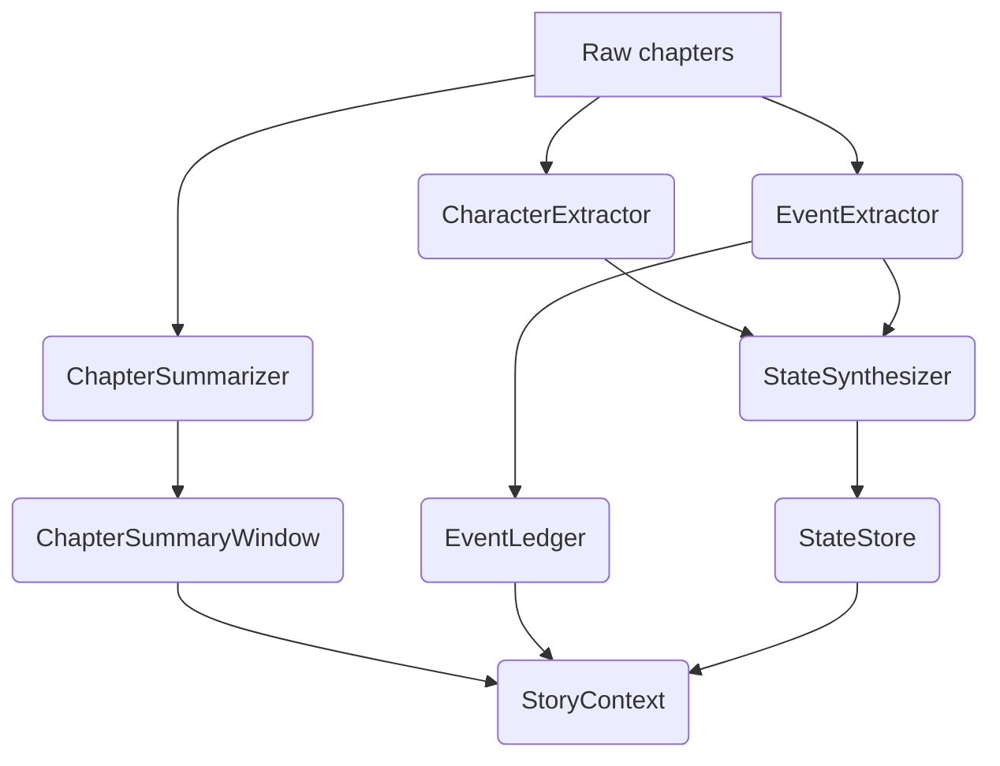

# Analysis 模块记忆化设计

> 参考 `docs/memory_system.md` 的“三层记忆”思想，为 `analysis/` 模块制定可落地的设计方案。

## 1. 设计目标

- **结构化记忆而非全文**：输出的数据结构直接对应业务 prompt；缓存命中后即可复用。
- **三层记忆分工**：章节滑窗（短期）、事件账本（中期）、状态快照（长期）。
- **LLM 可验证结果**：所有分析产物都能追溯到原文片段。
- **与 core 模块解耦**：`StoryContext` 是唯一沟通接口，文件写入交由 `.story_cache/`。

## 2. 模块拆分

```
analysis/
├── __init__.py            # StoryAnalyzer（总调度）
├── context.py             # dataclasses + StoryContext
├── layers/
│   ├── __init__.py
│   ├── chapter_window.py  # ChapterSummaryWindow（短期）
│   ├── event_ledger.py    # EventLedger（中期）
│   └── state_store.py     # StateStore（长期）
├── extractors/
│   ├── __init__.py
│   ├── chapters.py        # ChapterSummarizer
│   ├── characters.py      # CharacterExtractor / PersonalityAnalyzer
│   ├── events.py          # EventExtractor（含 impact 判定）
│   ├── relationships.py   # RelationshipMapper
│   └── state.py           # StateSynthesizer（world / unresolved）
└── prompt_templates/
    ├── chapter_summary.txt
    ├── event_extraction.txt
    └── state_update.txt
```

- `layers`：只负责内存结构的增删改查，不关心 LLM。
- `extractors`：带 LLMProvider 依赖，负责把原文 chunk → 结构化对象。
- `prompt_templates`：靠近 owner，方便单测中快照校验。

## 3. 数据模型（`analysis/context.py`）

```python
@dataclass
class ChapterSummary:
    chapter: int
    title: str
    pov: str
    beats: list[str]
    mood: str
    synopsis: str
    irreversible_flags: list[str]  # 章节内不可逆事件 id

@dataclass
class PlotEvent:
    event_id: str
    chapter: int
    type: Literal["conflict","reveal","progress","setback"]
    participants: list[str]
    summary: str
    impact: EventImpact
    is_irreversible: bool

@dataclass
class EventImpact:
    power_shifts: dict[str, str]
    relation_changes: dict[str, str]
    world_flags: list[str]

@dataclass
class CharacterState:
    name: str
    aliases: list[str]
    realm: str | None
    role: Literal["main","support","minor"]
    personality: list[str]
    relationships: list["Relationship"]
    unresolved: list[str]

@dataclass
class StoryState:
    current_arc: str
    world_tension: Literal["low","medium","high"]
    major_conflicts: list[str]
    time_constraints: list[str]
    unresolved_events: list[str]

@dataclass
class StoryContext:
    metadata: dict[str, Any]
    chapter_window: list[ChapterSummary]
    events: list[PlotEvent]
    characters: dict[str, CharacterState]
    story_state: StoryState

    def for_prompt(self) -> dict[str, Any]:
        """Transform into prompt payload sections."""
```

## 4. 三层记忆实现

### 4.1 短期：章节滑动窗口

- **组件**：`ChapterSummaryWindow`
- **来源**：`ChapterSummarizer` 每章 200–500 字摘要 + beats，追加至窗口。
- **策略**：窗口大小默认 12 章，可在 `config/settings.py` 配置；超出后丢弃最旧。
- **用途**：CLI `continue`、`compress` 编排 prompt 时直接注入。

### 4.2 中期：事件账本

- **组件**：`EventLedger`
- **数据**：`PlotEvent` 列表 + 索引（按人物、章节、impact）。
- **写入**：`EventExtractor` 读取章节文本，调用 prompt 输出 JSON 数组，自动生成 `event_id`（`E{date}_{seq}`）。
- **能力**：
  - `find_by_character("林凡")`
  - `list_irreversible_since(chapter=128)`
  - `to_timeline()`：按章排序用于缓存和调试。
- **与 memory_system.md 对齐**：聚焦“不可逆”“有长期影响”的事件。

### 4.3 长期：状态存储

- **组件**：`StateStore`
- **职责**：汇总世界/人物状态，写入 `StoryState` + `CharacterState`。
- **来源**：
  1. `CharacterExtractor`：基础画像、别名、角色等级。
  2. `PersonalityAnalyzer`：性格锚点，防止“性格漂移”。
  3. `StateSynthesizer`：根据事件 impact 更新 `world_tension`、`major_conflicts`、`unresolved_events`。
- **输出**：提供 `get_prompt_sections()`，以“人物状态”“未解决剧情”等形式拼装。

## 5. 分析流程（`StoryAnalyzer.analyze`）

1. **分块**：通过 `parser/text_splitter.py` 生成章节或场景文本。
2. **人物/别名提取**：`CharacterExtractor` + `merge_aliases`。
3. **关系与性格**：`RelationshipMapper`、`PersonalityAnalyzer`。
4. **章节摘要**：逐章调用 `ChapterSummarizer` → `ChapterSummaryWindow.upsert(chapter_summary)`.
5. **事件抽取**：`EventExtractor.extract` → `EventLedger.record`.
6. **状态刷新**：`StateSynthesizer.update_state(events, characters)`。
7. **缓存**：`cache.ContextStore.save(hash, StoryContext)`，`metadata` 包含 `_version`, `model`, `chunk_size`, `window_size`。



## 6. Prompt 约定

- `chapter_summary.txt`：强调 POV、氛围、不可逆节点；输出 Markdown。
- `event_extraction.txt`：严格 JSON，附【事件标准】段落（引用 memory system 规则）。
- `state_update.txt`：输入“当前 state + 新事件”，输出 diff，供 `StateStore` 合并。

所有模板都要写入 tests 快照，确保行为稳定。

## 7. CLI 集成

- `story analyze <file>`：运行完整 pipeline，把 `StoryContext` 写入 `.story_cache/<hash>/context.json`。
- `story continue`：读取缓存 + 最近正文，Prompt 拼装顺序遵循 memory doc：“世界观 → 人物状态 → 剧情状态 → 章节摘要 → 正文 → 指令”。
- `core` 模块在需要提示时调用 `StoryContext.for_prompt()`。

## 8. 测试策略

| 测试 | 目的 |
|------|------|
| `tests/analysis/test_chapter_window.py` | 滑窗保持 N 章、可序列化 |
| `tests/analysis/test_event_extractor.py` | prompt 响应解析、过滤低价值事件 |
| `tests/analysis/test_state_store.py` | impact 合并、未解决事件跟踪 |
| `tests/analysis/test_story_context.py` | `for_prompt()` 输出结构化段落 |

- 引入 fakes：`FakeLLMProvider` 返回固定 JSON，保障离线。

## 9. 后续迭代

1. **事件图谱**：为 `EventLedger` 增加依赖图，计算剧情主/支线。
2. **冲突检测**：在 `StateSynthesizer` 中校验人物设定前后一致。
3. **可视化**：输出 timeline markdown，辅助人工审阅。

